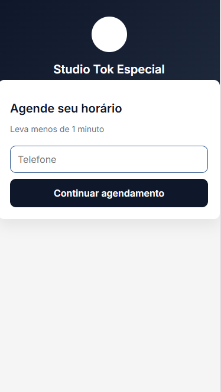
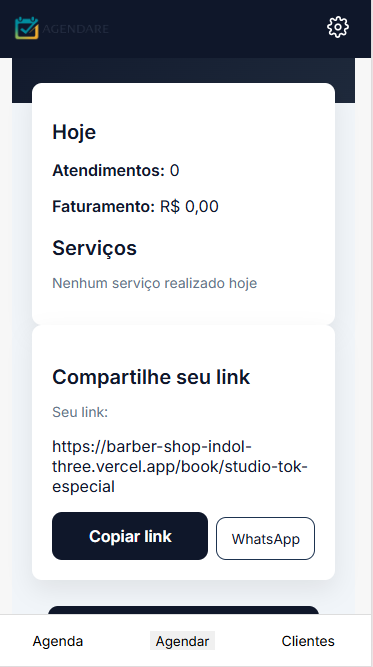
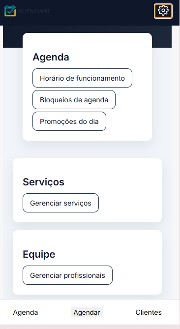
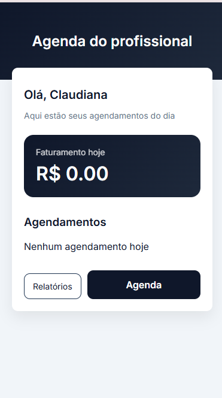

# Multi-Tenant Booking SaaS

Plataforma SaaS de agendamento multi-tenant desenvolvida para pequenos negócios que precisam organizar horários, profissionais e disponibilidade de forma simples e confiável.

O sistema foi criado com foco em regras reais de negócio, gestão operacional e separação de dados por empresa.

---

## 🚧 Status

Projeto em desenvolvimento ativo, atualmente em fase de testes reais em um salão parceiro.

---

# ✨ Funcionalidades

## 👤 Cliente

* Agendamento online
* Fluxo simplificado
* Compartilhamento de link público
* Validação de disponibilidade em tempo real

## 👨‍💼 Profissional

* Visualização dos agendamentos do dia
* Controle operacional simples
* Visão de faturamento diário

## 🏢 Administração

* Gestão de horários de funcionamento
* Bloqueios de agenda
* Gerenciamento de profissionais
* Gerenciamento de serviços
* Estrutura preparada para dashboard operacional

---

# 🧠 Destaques Técnicos

* Arquitetura separada por camadas
* Sistema multi-tenant
* Motor de geração de slots
* Validação de conflitos de horário (overlap)
* JWT Authentication
* Regras reais de disponibilidade
* Separação de acesso por perfil
* Backend focado em regras de negócio

---

# 🛠️ Stack

## Backend

* Node.js
* Express
* PostgreSQL
* JWT

## Frontend

* React

## Deploy

* Vercel
* Render

---

# 🏗️ Arquitetura

O backend segue separação clara de responsabilidades:

* Controllers
* Services
* Repository
* Middlewares
* Database Layer

Com foco em:

* clareza
* manutenção
* escalabilidade gradual
* regras de domínio explícitas

---

# 📷 Prints do Sistema

## 👤 Cliente

---

## 🏢 Área Administrativa

---

## 👨‍💼 Área do Profissional

---

# 🎯 Objetivo do Projeto

Este projeto foi desenvolvido para simular desafios reais de sistemas de agendamento utilizados por pequenos negócios locais.

O foco principal não foi apenas CRUD, mas implementação de regras reais de negócio, organização arquitetural e experiência operacional.

---

# 🚀 Possíveis Evoluções

* Dashboard financeiro
* Relatórios operacionais
* Notificações automáticas
* Controle avançado de disponibilidade
* Integração com pagamentos
* Agenda mensal avançada
* Melhorias de UX/UI

---

# 💡 Aprendizados Aplicados

Durante o desenvolvimento do projeto foram trabalhados conceitos como:

* modelagem de domínio
* arquitetura backend
* autenticação
* multi-tenant
* regras de disponibilidade
* controle de conflitos
* separação de responsabilidades
* integração frontend/backend
* deploy de aplicações fullstack
